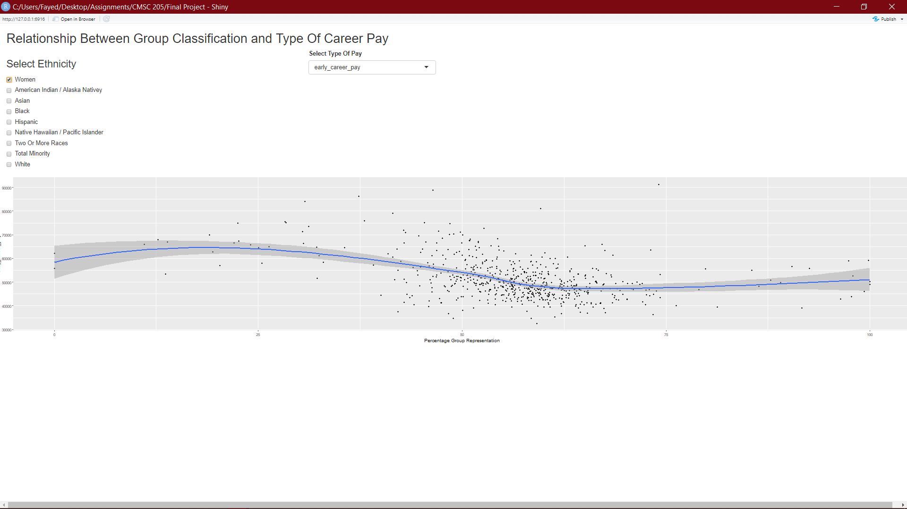
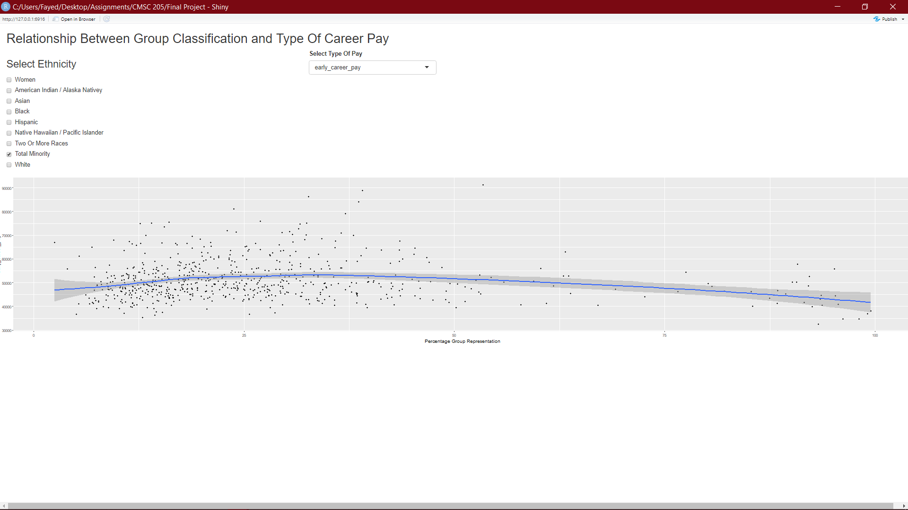
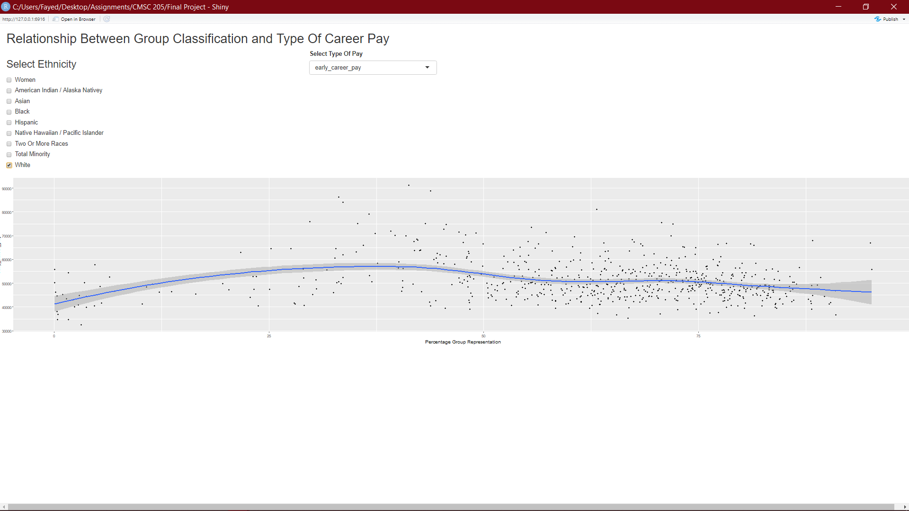
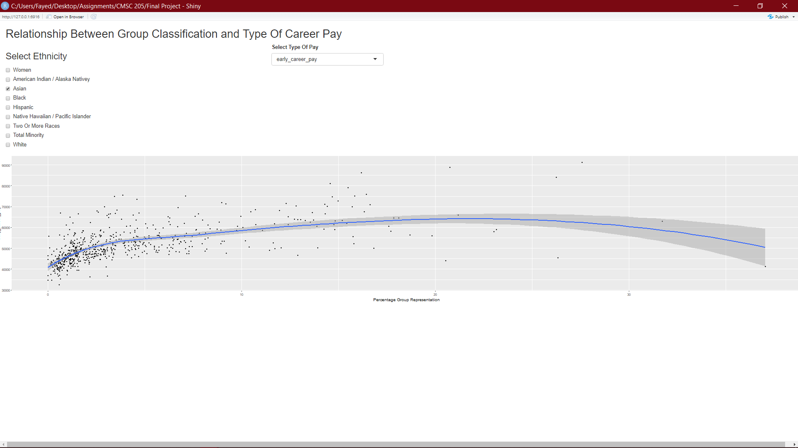

```{r setup, include=FALSE}
knitr::opts_chunk$set(echo = FALSE, message=FALSE, warning=FALSE, fig.height = 4, fig.width = 6 )
```


```{r}
library(tidyverse) 
```
```{r include = FALSE}
Diversity<- read_csv("C:/Users/Fayed/Desktop/Assignments/CMSC 205/Final Project/diversity_school.csv")

Salary<- read_csv("C:/Users/Fayed/Desktop/Assignments/CMSC 205/Final Project/salary_potential.csv")

```
```{r include = FALSE}
D1 <- full_join(Diversity,Salary,by=c("name"="name"))
D2<-D1 %>% drop_na()
D3<- D2%>% mutate(Percentage_Enrollment=enrollment*100/total_enrollment )
write_csv(D3,file="Project_3.csv")

```
```{r include = FALSE}
library(shiny)
library(tidyverse)

data(D3)


# Define UI for application 
ui <- fluidPage(
  
  # Application title
  titlePanel("Relationship Between Group Classification and Type Of Career Pay"),
  
  fluidRow(
    
    column(4, 
           checkboxGroupInput("airport_list", 
                              h3("Select Ethnicity"), 
                              choices = list("Women" = "Women", 
                                             "American Indian / Alaska Nativey" = "American Indian / Alaska Native",
                                             "Asian"="Asian", "Black"="Black","Hispanic"="Hispanic","Native Hawaiian / Pacific Islander"="Native Hawaiian / Pacific Islander", "Two Or More Races"="Two Or More Races", "Total Minority"="Total Minority", "White"="White"), 
                                        
                              selected = "White")
           ),

           
    
    column(4,
           varSelectInput("variable", 
                        "Select Type Of Pay", 
                      data = D3 %>% select(mid_career_pay,early_career_pay))
  ),

    # Show a plot of the generated distribution
  fluidRow(
      plotOutput("plot")
    )
))


# Define server logic required to draw a histogram
server <- function(input, output) {
  
  output$plot <- renderPlot({
    airport_list <- input$airport_list
    num_month <- input$month_number
  
   
    ggplot(data = D3 %>% filter(category %in% airport_list)) + 
      geom_point(aes(x = Percentage_Enrollment, y=!!input$variable), se=FALSE) + geom_smooth(aes(x = Percentage_Enrollment, y=!!input$variable)) + 
      xlab("Percentage Group Representation") 
    
    
    
  })
}


# Run the application 
shinyApp(ui = ui, server = server)


```


 

My tidy app is designed to show various trends in career pay for students graduating from different universities based on their group (ethnicity and/or gender) in the US. According to payscale.com, “Equal pay for equal work is not a reality for many people of color. When we control for education, years of experience, occupation and other compensable factors, most men and women of color still earn less than white men.” Based on the data I’ve collected and the app I’ve constructed; it will give us farther insight into the legitimacy of the topic. On the x-axis we have enrollment percentage of the respective group and on the y-axis, we have career-pay. One of my findings show that early-career and mid-career pay vary similarly across all groups but not significantly, mid-career pay is just increased compared to early-career pay, so we’ll stick with early-career pay to make our observations as fair as possible. My most important finding includes the first screenshot of my app which shows the early-career pay for the group: Women, where a big percentile of Women (50-75 percentile) are paid less than 50 thousand on average, which is the least when comparing to all the groups, this shows Women are paid less than of all groups on earlier stages of their career. Another significant observation includes the group: Total Minorities (See 2nd Screenshot), where Total Minorities (12.5-50 percentile) are paid less than 55 thousand dollars on average compared to majority of the group White (3rd Screenshot, 32.5-75 percentile); where they are paid from more than 55 thousand to 50 thousand on average. My second observation shows that the group White are paid more than the group Total Minorities. My third observation (See 4th Screenshot) shows, majority of the group Asian (0-10th percentile) are paid around 42-60 thousand on average. This shows that majority of the group Asian are paid the most and also the least which marks the highest standard deviation for any group I’ve accounted for in these observations; this also sets the group Asian as the most paid group because throughout they are paid more than 50 thousand dollars from 2.5th percentile to 35th percentile of the group. My findings are in line with findings from payscale.com where Asian men and Women are the highest earning groups and the group Women are the lowest earning group. Also, according to payscale.com, where they accounted their data with time too, showed that the wage gap has significantly decreased. But it will be awhile until the biggest gap which is the salary gap between the Group Women and other groups is closed if employers or workplaces don’t stop evaluating pay check by group designation. 


{width=500px}


{width=500px}


{width=500px}


{width=500px}


The hardest part of every project I’ve worked on was choosing the datasets. Over the last three projects I’ve realized it’s better to look at random datasets that you can suspect and not predict directly that different variables will show an expected relationship; rather than going on a random hunch or idea and looking for datasets that are really specific to that cause or idea and spending hours to find them. For this project I’ve decided to join two datasets that has data from Universities regarding student enrollments by race in one and career pay in the other one. Hence, for the first part of the project, I found the two datasets on Keggle and decided to join them with the character variable, “name”, which represents university names on both datasets using a full join, to keep all possible outcomes and then giving my data a new name (D2 successor to D1), I decided to remove all the N/A or incomplete rows. I generally give my datasets a new name whenever I wrangle, join or tidy instead of using a (%<%) pipe to do it all together. This helps me keep track of big changes I’m making to my dataset, in case I have make final changes, if my initial thesis for the project does not look strong in anyway at the end. The dataset has number of enrollments of each category or ethnicity/group in different universities, which is disregarding different variables that might affect that number like state size, minimum wage, age, or population distribution etc. Then I decided to mutate my dataset to make a new double variable which is the percentage enrollment compared to the total enrollment in that specific university to take a more fair or controlled variable. For my tidy app, I copied the template or example 6.5 from our class which very much suited the way I needed my variable to be presented. I didn’t need the slider in my project so I decided to remove it, and kept the checkbox to select race for the user and the drop-down menu for the user to select what period of career pay to show in my plot. My initial challenge at this point was to decide which variable to put in which selection style, because two of my variables were presented column-wise (early_career_pay and mid_career_pay) and the other one was row-wise(category). I thought of using pivot_longer to join mid_career_pay and early_career_pay together to make another row-wise variable. But then I realized in the example one of the variables called origin (airport codes) was also arranged row-wise which was used in the checkbox and then filtered in the ggplot section. Hence, I decided to use my variable, “category,” in place of the origin, which worked. For the plot I decided to go with geom_point for a scatterplot style of graph. I didn’t use any special aesthetics here because the user will be displaying individual graphs based on their use/wish, which won’t require different shapes, colors or sizes to be distinguishable. 
